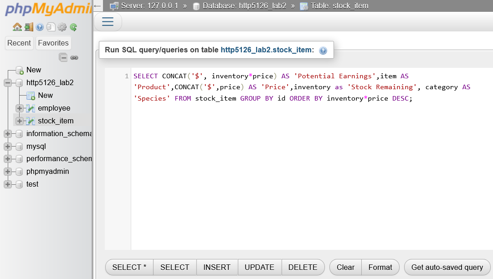

# http5126-Database
Class content from Database Design &amp; Devopment

***HTTP5121 - atabase Design &amp; Devopment*** This class will focus on retrieving data stored in the system using SQL.

>[SQL](https://www.w3schools.com/sql/)



>Week 2 queries e.g.
```
- SELECT item AS 'Product', category AS 'Animal' FROM stock_item; 
- SELECT first_name, last_name FROM employee WHERE id = '115'; 
```
>Week 4 queries e.g.
```
- SELECT category, SUM(inventory), AVG(price) FROM stock_item GROUP BY category HAVING SUM(inventory) < 100 AND AVG(price) < 100;
- SELECT category, AVG(price) AS 'Agerage Price ($)' FROM stock_item WHERE NOT inventory = '0' GROUP BY category; 
```

>!NOTE
> - MAMP
> - XAMPP